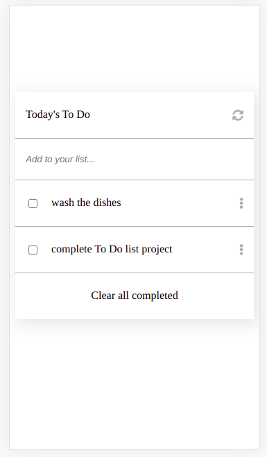

# todo-list
This is a simple todo list web page which is be built using webpack and served by a webpack dev server.

List Structure                                    |
:------------------------------------------------:|
                        |

## Online version
[demo](https://mmsesay.github.io/todo-list/)

## Built With

- HTML / CSS / JAVASCRIPT / WEBPACK

## How to run the program locally
- Clone the project: ```https://github.com/mmsesay/todo-list.git```
- Skip if you already have node installed otherwise download [nodejs](https://nodejs.org/en/download/) install it on your system
- Install the node modules: ```npm install```
- Run the app: ```npm start``` or ```yarn start```

## Author

👤 **Muhammad Mustapha Sesay**

- GitHub: [@mmsesay](https://github.com/mmsesay)
- Twitter: [@DeeMaejor](https://twitter.com/DeeMaejor)
- LinkedIn: [LinkedIn](https://linkedin.com/in/muhammad-m-sesay)

## 🤝 Contributing

Contributions, issues, and feature requests are welcome!

Feel free to check the [issues page](../../issues/).

## Show your support

Give a ⭐️ if you like this project!

## Acknowledgments
- microverseinc for the readme template
- @mshwery [Minimalist](https://web.archive.org/) for the design template

## 📝 License

This project is [MIT](./MIT.md) licensed.